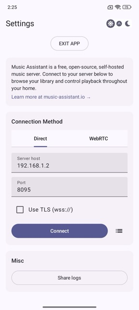
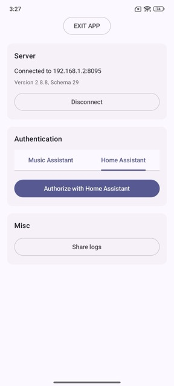
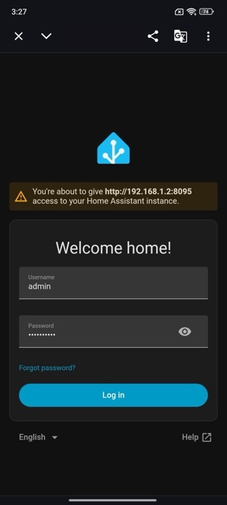

# Connect to Server using a Direct Connection Method
 
To connect to your Music Assistant server using a Direct Connection Method, you have a few options: connect via hostname (default), via IP address, or via a reverse proxy / tunnel if your server is exposed to the internet that way.
 
Connecting via hostname is recommended, as it ensures you can still reach your server even if its IP address changes. If you have a static IP set, connecting via IP address works just as well.
 
## Fill in the fields
 
| Field | Description |
|---|---|
| **Server host** | The hostname or IP address of your Music Assistant server e.g. `homeassistant.local`*, `192.168.1.2` or a remote address like `ma-app.duckdns.org` or `musicassistant.mydomain.com`. |
| **Port** | The port your Music Assistant server is listening on (default: `8095`). |
| **Use TLS (wss://)** | Enable this if your server uses a secure (TLS) connection. |
 
\* `homeassistant.local` is the default hostname of your Home Assistant server. You can use the hostname of your Home Assistant server when Music Assistant is installed as a Home Assistant App in HA OS.
 

 
Once your details are filled in, tap **Connect** to move on to the next step.
 
### Connecting over the internet without exposing the MA port
 
If you don't want to expose the Music Assistant port (`8095` by default) directly to the internet, you can put your server behind a reverse proxy or tunnel (for example a Cloudflare Tunnel, Nginx, Traefik, or similar) and connect through that instead. The proxy terminates the connection on whichever port you configure and forwards the traffic internally to Music Assistant, so only that port ever needs to be reachable from outside.
 
In that setup, fill in the fields like this:
 
| Field | Value |
|---|---|
| **Server host** | Your domain, e.g. `musicassistant.mydomain.com` — **no port needed here** |
| **Port** | The port your reverse proxy is listening on externally (e.g. `443` for HTTPS, `80` for HTTP, or a custom port if you've configured one) |
| **Use TLS (wss://)** | Enable this if your reverse proxy terminates a secure (TLS/HTTPS) connection; leave disabled if it's plain HTTP/WS |
 
> **Note:** Even if your reverse proxy address normally doesn't require you to specify a port in a browser (e.g. `443` is assumed for HTTPS, `80` for HTTP), this app still expects the port to be filled in explicitly — enter whatever port your proxy actually listens on externally.
 
There are many ways to set up a reverse proxy or tunnel; this app doesn't require or favor any particular method, protocol, or port — use whichever fits your setup.
 
## Authentication
 
After connecting, you will be asked to sign in. Choose one of the following methods:
 
| Authentication method | Description |
|---|---|
| **Music Assistant** | Sign in with the username and password of a Music Assistant user. |
| **Home Assistant** | Sign in using Home Assistant OAuth. The Home Assistant user must be linked to the Music Assistant server. |
 

 
After signing in, you can configure the [Local Player](local-sendspin-player-settings.md) or [start using the app](home.md) right away.
