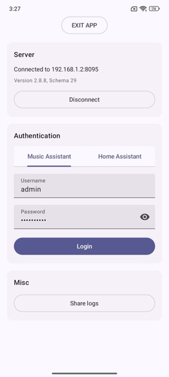

# Connect to Server over LAN

To connect to your Music Assistant server over LAN, you have two options: connect via hostname (default) or via IP address.

Connecting via hostname is recommended, as it ensures you can still reach your server even if its IP address changes. If you have a static IP set, connecting via IP address works just as well.

## Fill in the Fields

| Field | Description |
|---|---|
| **Server host** | The hostname or IP address of your Music Assistant server (e.g. `homeassistant.local`* or `192.168.1.2`). |
| **Port** | The port your Music Assistant server is listening on (default: `8095`). |
| **Use TLS (wss://)** | Enable this if your server uses a secure (TLS) connection. This is usually not required for direct LAN connections. |

\* `homeassistant.local` is the default hostname of your Home Assistant server. You can use the hostname of your Home Assistant server when Music Assistant is installed as a Home Assistant App in HA OS.

Once your details are filled in, tap **Connect** to move on to the next step.

## Authentication

After connecting, you will be asked to sign in. Choose one of the following methods:

| Authentication method | Description |
|---|---|
| **Music Assistant** | Sign in with the username and password of a Music Assistant user. |
| **Home Assistant** | Sign in using Home Assistant OAuth. The Home Assistant user must be linked to the Music Assistant server. |

Once signed in, you are ready to use the app.