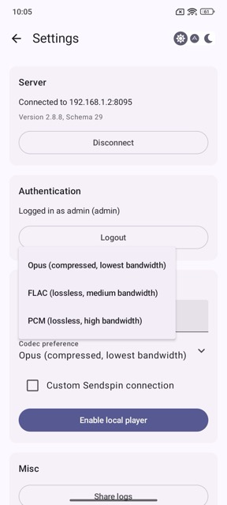
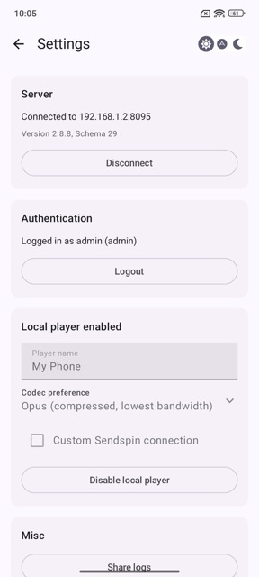

# Setting up the Local Player (optional)

The Music Assistant App serves two purposes: controlling external Music Assistant players, and playing music locally through the app on your device.

You can use the app purely as a remote control for external players, with the local player disabled. Or you can configure it as a Sendspin client to play music directly through your device.

The in-app Local Player is designed for personal, mobile listening — through your phone's speakers, headphones, or in-car systems like Apple CarPlay and Android Auto. It is not intended for home audio setups where the app would act as a source device feeding into DACs, amplifiers, or grouped speaker systems.

---

## Enabling the Local Player

In **Settings**, scroll to the **Local player (Sendspin protocol)** section.

Before enabling, configure the following options:

- **Player name** — The name that will appear in Music Assistant (default: your device name).
- **Codec preference** — The audio codec used for streaming. See [Codec Preference](#codec-preference) below.
- **Custom Sendspin connection** — Leave unchecked unless your setup requires a custom connection (see [Custom Sendspin Connection](#custom-sendspin-connection)).

Tap **Enable local player** to activate it. The section header will update to **Local player enabled**, and the button will change to **Disable local player**.

> **Good to know:** The Local Player is hidden by default in the Music Assistant Web UI, but visible under Music Assistant > Settings > Players as long as it is registered to the server. It registers automatically when the Local Player is enabled and the app is active and connected to the server. When the app is inactive, the player is de-registered and its settings are no longer editable.

---

## Codec Preference

The codec controls how audio is compressed and streamed from your Music Assistant server to the app. Choose based on your network conditions and how much audio quality matters to you.

- **Opus** *(Compressed, lowest bandwidth)* — A compressed format that uses the least data. Audio quality is good but not lossless. Best for mobile data connections, slower Wi-Fi, or when battery and bandwidth are a concern. This is the recommended default for most users.

- **FLAC** *(Lossless, medium bandwidth)* — Streams audio in full quality without any loss, using a moderate amount of bandwidth. A good balance between quality and network load. Best suited for home Wi-Fi where you want the best sound without putting too much strain on your network.

- **PCM** *(Lossless, high bandwidth)* — Streams uncompressed audio at the highest possible quality, but uses significantly more bandwidth than FLAC. Only recommended on fast, stable Wi-Fi connections where network load is not a concern.

> **Not sure which to pick?** Start with **Opus**. If you're on a reliable home Wi-Fi connection and want the best audio quality, try **FLAC**.

---

## Custom Sendspin Connection

If your Music Assistant server is not reachable via the default connection, enable **Custom Sendspin connection** to configure it manually.

| Field | Description |
|---|---|
| **Host** | The hostname or IP address of your Music Assistant server |
| **Port** | Port number (default: `8095`) |
| **Path** | Sendspin endpoint path (default: `/sendspin`) |
| **Use secure connection (WSS/TLS)** | Enable if your server uses a secure WebSocket connection |

After setting up the Local Player, you can [start using the app](home.md).