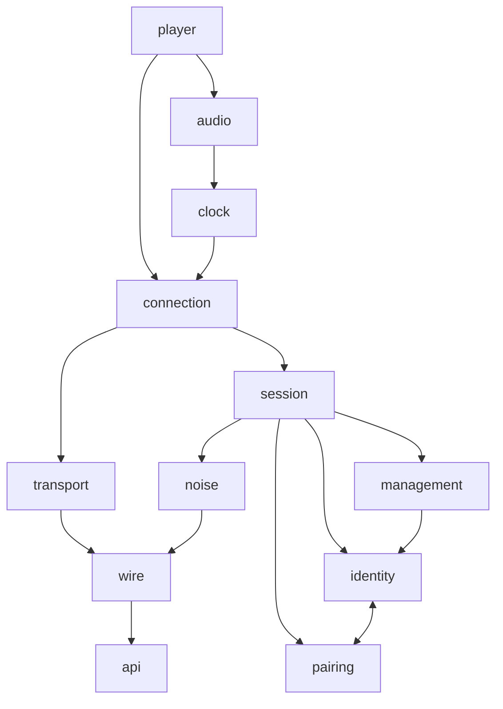
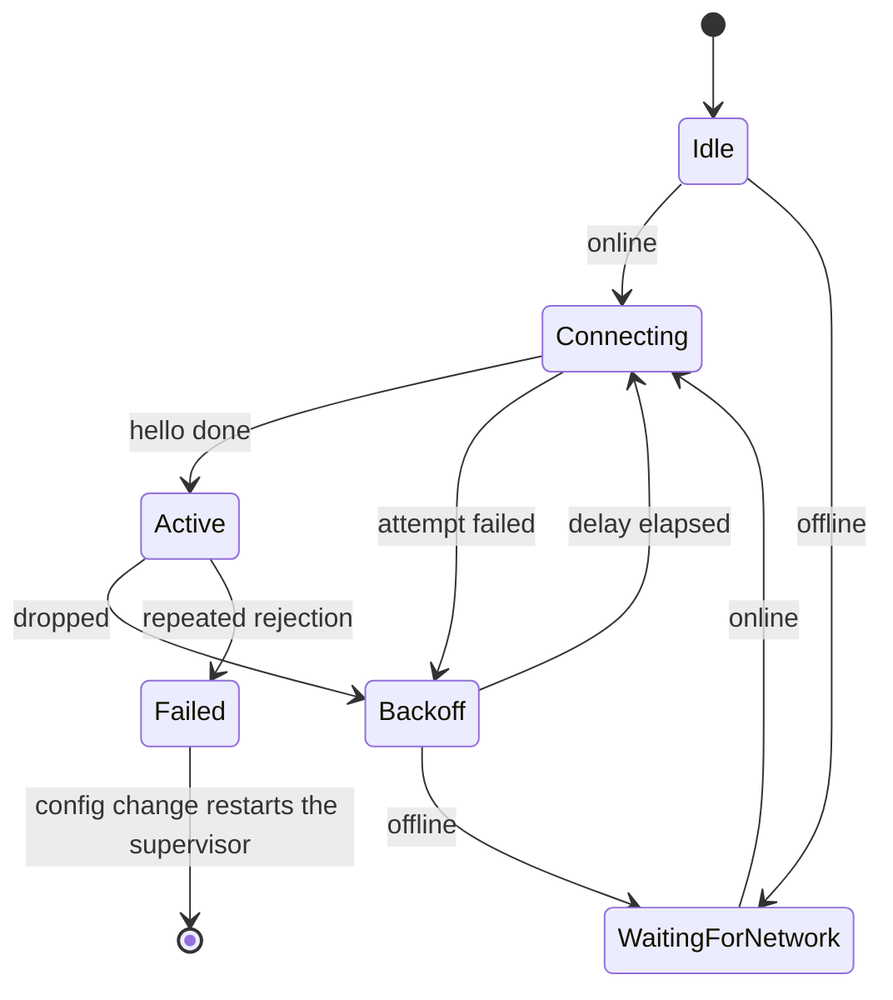
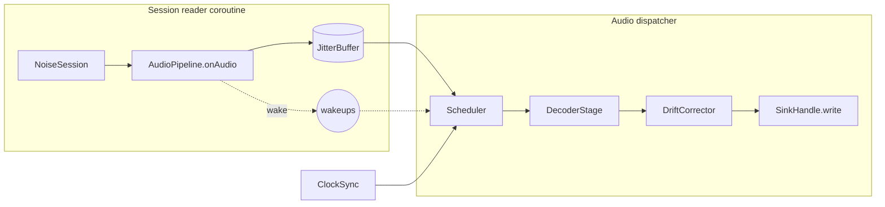

# Sendspin local player

The `:sendspin` module is the Music Assistant Sendspin client for the `player@v1` role. It
connects to a Sendspin server, keeps an encrypted session, and follows the server clock. It plays
the audio stream in time with the other players in a group. The connection is always encrypted:
there is no plaintext session. The module is a pure Kotlin Multiplatform leaf. It depends on no
other Gradle project. It contains no Compose code, no Koin code, and no `expect`/`actual`
declaration. Each platform difference is an interface that the application implements.

## Scope

The module does this work:

- Transport, Noise encryption, and the session state machine.
- Client identity, trust records, and pairing.
- Server clock synchronization.
- Audio buffering, decode dispatch, and output scheduling.

The module does not do this work:

- **No control plane.** Play, pause, seek, and queue commands go over the Music Assistant API in
  the application. The module sends `player@v1` messages only.
- **No WebRTC.** For a data-channel connection the application supplies
  `Endpoint.WebRtc(openChannel)`, and the module calls it once per attempt.
- **No platform audio.** `AudioSink` and `DecoderFactory` are ports.
- **No settings and no text.** The module never writes application settings and holds no
  user-facing string. It reports codes, and the application maps them to resources.

## Use the module

### Entry point

One function creates the player. It is the only public function outside the `api` package.

```kotlin
fun SendspinPlayer(
    config: StateFlow<LocalPlayerConfig?>,
    deps: SendspinDeps,
    scope: CoroutineScope,
): SendspinPlayer
```

The player runs for the life of `scope`. It has no `start` and no `stop`: a `null` config
disables it, and that is the only stop.

The package `io.music_assistant.sendspin.api` plus this factory are the whole public surface.
Every other declaration in the module is `internal`, so the compiler rejects a leak into the
application.

### Configuration

`LocalPlayerConfig` has two classes of field.

| Field | Class | Effect of a change |
| --- | --- | --- |
| `endpoint` | Reconnect | Restarts the connection. The audio pipeline is untouched. |
| `deviceName` | Reconnect | Restarts the connection. |
| `codecPreference` | Reconnect | Restarts the connection. |
| `userDelayMs` | Live | Applies to the next scheduled chunk. |
| `bufferCapacityBytes` | Live | Applies to the buffer now. Advertised at the next hello. |

Keep the same `Endpoint` instance while the endpoint did not change. `Endpoint.WebRtc` compares
by identity, so a new instance restarts the connection.

### Ports the application implements

| Port | Purpose | Implementation |
| --- | --- | --- |
| `AudioSink` | Platform audio output. `open` builds a new device stream each time. | `AudioTrackSink.kt` (Android), `AudioQueueSink.kt` (iOS) |
| `DecoderFactory` | Creates one `AudioDecoder` for a codec. | `AndroidDecoders.kt`, `IosDecoderFactory` in `AudioQueueSink.kt` |
| `SendspinKeyStore` | Byte-blob storage for identity and trust. Reads never throw. | `SettingsSendspinKeyStore.kt` |
| `SendspinTransport` | Frames over one WebRTC data channel. | `DataChannelTransport` in `LocalPlayerEndpoints.kt` |

`SendspinDeps` also takes the application's `HttpClient`, an `online` flow, a `pairWebPlayer`
call, and the audio dispatcher.

A decoder can be a **pass-through**: it returns `outputCodec != PCM`, and the sink decodes the
bytes itself. iOS works this way. The scheduler then treats the bytes as opaque. It cannot trim,
pad, or resample them, so it schedules open loop. See "Audio path".

### State and events

`state` is a `StateFlow<PlayerState>`.

| State | Meaning |
| --- | --- |
| `Disabled` | The config is `null`. |
| `Connecting(attempt)` | An attempt is in progress. |
| `Connected(...)` | The session is up. Carries the player id, the server name, the clock quality, and the audio status. |
| `Reconnecting(...)` | The connection dropped and a retry is scheduled. `nextRetryAtMs` is `null` while the module waits for the network. |
| `Failed(cause)` | The module gave up. It leaves this state only on a config change. |

`events` is a buffered `Flow<PlayerEvent>`. A slow collector loses the oldest event.

| Event | The application must |
| --- | --- |
| `PlaybackStarted` | Nothing. The first audio reached the sink. |
| `PlaybackStopped(cause)` | Nothing. Show the cause if it helps the user. |
| `ServerRefreshNeeded` | Refetch the player list. The server assigned or changed the player id. |
| `FocusRegained` | Resume playback if the user wants it. |
| `Warning(code)` | Show a notice. The module already recovered or degraded. |

## Architecture

### Package dependencies



The diagram shows the structure. Two edges are left out to keep it readable: `player` also uses
the layers below `connection` and `audio` directly, and every package may use `api`.

Two edges look wrong and are not. `clock` points at `connection` because the probe loop throws
the connection layer's silent-server exception. `identity` and `pairing` point at each other. The
trust store encodes its pairing token with `PairingToken`, and the pairing handler commits the
finished record into the trust store.

Nothing depends on `player`. The `api` package depends on nothing inside the module.

| Package | Responsibility | Key files |
| --- | --- | --- |
| `api` | Public types and ports. | `SendspinPlayer.kt`, `LocalPlayerConfig.kt`, `PlayerState.kt`, `PlayerEvent.kt`, `AudioSink.kt`, `AudioDecoder.kt` |
| `player` | Composition root. Maps internal state to `PlayerState` and `PlayerEvent`. | `SendspinPlayerImpl.kt` |
| `connection` | Connection state machine and the single reconnect policy. | `ConnectionSupervisor.kt`, `ReconnectPolicy.kt`, `ConnectionState.kt`, `SilentPairing.kt` |
| `session` | One encrypted session over one transport. | `NoiseSession.kt`, `ActivationPolicy.kt`, `SessionTypes.kt` |
| `transport` | Frames over one connection attempt. No reconnect. | `WebSocketTransport.kt`, `TransportConnector.kt`, `ProxyAuth.kt` |
| `noise` | Noise protocol, framing, and pre-shared keys. | `NoiseProtocol.kt`, `SendspinHandshake.kt`, `NoiseFraming.kt`, `SendspinPsk.kt` |
| `identity` | Static key pair and trust records. | `SendspinIdentity.kt`, `TrustStore.kt` |
| `pairing` | Pairing-PSK flow and the pairing token codec. | `PairingHandler.kt`, `PairingToken.kt` |
| `management` | `management/*` requests from a paired server. | `ManagementHandler.kt` |
| `audio` | Buffer, decode, drift correction, and scheduling. | `AudioPipeline.kt`, `Scheduler.kt`, `JitterBuffer.kt`, `DecoderStage.kt`, `DriftCorrector.kt`, `StreamLifecycle.kt` |
| `clock` | Server time estimate and liveness. | `ClockSync.kt`, `ClockFilter.kt`, `ClockProbe.kt` |
| `wire` | Parses each message once. | `Messages.kt`, `WireCodec.kt`, `Binary.kt`, `VersionedRole.kt` |

### Concurrency

Ownership follows the coroutine tree. Read it as the teardown order.

```
scope (supplied by the application)
└─ config.enabled collector           collectLatest: "false" cancels everything below
   └─ runEnabled()                    trust store, clock sync, pipeline, connector
      ├─ pipeline.run()               on deps.audioDispatcher; outlives every connection
      ├─ live-config collector        userDelayMicros, capacityBytes
      └─ ConnectionSupervisor.run()   restarted when a reconnect-class field changes
         └─ one attempt at a time
            ├─ session.run()          reader coroutine
            └─ companion              clock probes and state reports
```

These invariants hold:

- No class implements `CoroutineScope`. Cancellation is the only teardown.
- The session reader never blocks on the sink. It must stay free to process `stream/clear`.
- The audio thread is the single owner of the decoder and the sink handle.
- The audio pipeline outlives the connection, so buffered audio drains through a reconnect.

## Connection lifecycle



`ConnectionSupervisor` runs one attempt at a time. An attempt is a `coroutineScope` that holds
the session and its companion, so one failure ends both. On cancellation the session sends
`client/goodbye` first: `UserRequest` when the config went `null`, and `Restart` otherwise.

Every attempt ends with a `DropReason`. `ReconnectPolicy` turns it into one of three decisions:
retry after a delay, wait for the network, or fail. Only repeated `Rejected` drops can fail,
because the first rejections are expected. The server rejects a sentinel session with
`pairing_required` while the silent pairing call is still in flight. It admits the session on a
later attempt. The backoff is exponential with jitter and a cap, and it is unlimited while the
device is online. An attempt that stayed active long enough resets the attempt counter. The
constants live in `ReconnectPolicy.kt`.

Offline is not a timer. The supervisor waits on the `online` flow and attempts again at once when
the network returns.

## Protocol

The session uses `Noise_KKpsk2_25519_ChaChaPoly_SHA256`. **The server is the Noise initiator and
this client is the responder**, whichever side opened the connection. See
[`noise/README.md`](src/commonMain/kotlin/io/music_assistant/sendspin/noise/README.md) for the
cryptography, the specification mapping, and the test vectors.

One attempt runs these steps:

1. For a WebSocket endpoint only: send `auth` with the token and wait for `auth_ok`. This is the
   Music Assistant proxy, not Sendspin.
2. Exchange `client/init` and `server/init`.
3. Build the prologue from the exact transmitted bytes of both init messages. Never re-encode
   them.
4. Exchange the two `noise/handshake` messages. The server's message carries the `psk_id`, and
   the client selects the matching pre-shared key.
5. Exchange `server/hello` and `client/hello`. The client advertises the device name, the trust
   level, the role `player@v1`, the supported formats, and the buffer capacity.
6. Wait for the first admissible `server/activate`.

After step 4 every frame is a binary Noise ciphertext. The first plaintext byte is a type: JSON,
a fragment, or player audio. A message larger than one Noise message is fragmented and
reassembled. `NoiseFraming.kt` holds the rules.

Outbound traffic passes an explicit gate. The gate stays closed until the first admissible
activation, and it closes again during a pairing activity and during a re-handshake. All sends
take one mutex, because Noise nonces must stay in order. `ActivationPolicy.kt` holds the
admission rules as a pure function: it admits, rejects with `pairing_required` or `unauthorized`,
or aborts a pairing attempt with an unsupported method.

The server can start a re-handshake inside the encrypted channel. The gate closes, the previous
handshake hash becomes the new prologue, the reply goes out under the old keys, and the keys
swap. Granted roles and any pairing attempt in progress are discarded with the old keys.

## Audio path



The reader side never suspends. A reader that blocked on audio could not process the
`stream/clear` that would free the buffer.

`JitterBuffer` holds encoded chunks in server-timestamp order under a byte cap. It drops a chunk
at or before the last consumed timestamp, because that is a reconnect replay, and it drops an
exact duplicate. Over the cap it evicts the **furthest-future** chunk, so the head stays
continuous. The server honours the advertised capacity, so eviction is a safety net.

`Scheduler` plays each chunk at `serverTime` converted to local time plus the user delay. With
sink position feedback it compares that target against `now + audio queued in the sink + output
latency` and corrects the difference:

| Lead | Action |
| --- | --- |
| Far behind | Drop the chunk, or trim the late part off its head. |
| Far ahead | Wait, and wake early on a new chunk or a stream change. |
| Ahead | Write silence for the gap, then the chunk. |
| Slightly off | Resample the block gently. |
| In band | Write as is. |

Where the sink reports no position, the scheduler runs open loop: it waits until the chunk is
due, and drops it when it is late. The thresholds live in `Scheduler.kt`.

Every "retry later" exit happens before the decode, because decoders are stateful and a chunk
must be decoded exactly once.

`DriftCorrector` resamples interleaved 16-bit little-endian PCM by linear interpolation, with a
bounded rate change. Any other bit depth passes through unchanged.

Music Assistant sends `stream/clear` and then a same-format `stream/start` on every track change,
seek, and restart. That is a discontinuity, not a gapless boundary. `StreamLifecycle` therefore
answers `Restart` while the same format plays. A `Restart` flushes the sink and resets the
decoder, but it keeps both. A new device stream costs hundreds of milliseconds and the head of
the track. A format change, or a start from idle, rebuilds. The first `stream/start` of a new connection
that matches a still-playing stream is a resume, and the buffered audio survives it.

## Clock synchronization

`ClockProbe` sends `client/time` in bursts for the life of an attempt. `ClockSync` collects the
replies of one burst and feeds the sample with the lowest round-trip time to `ClockFilter`.
`ClockFilter` is a two-state Kalman filter over offset and drift. The audio thread reads an immutable snapshot of
the estimate without taking a lock.

`ClockQuality` reports `Good`, `Degraded` when the minimum round-trip time is high, and `Lost`
when no sample was accepted for a long time. The constants live in `ClockSync.kt` and
`ClockProbe.kt`.

The probe loop is also the liveness watchdog. A server that answers no probe for three
consecutive bursts is declared silent, which ends the attempt. This works over any transport,
because it needs the protocol only.

## Why this design

1. One owner per piece of state.
2. One reconnect policy, in one pure object.
3. Bounded queues everywhere. Nothing on the audio path grows without a limit.
4. Structured concurrency. Cancellation is the only teardown.
5. The audio pipeline outlives the connection, so buffered audio drains through a reconnect.
6. A small public surface, enforced by `internal` and checked by the compiler.

## How the application wires it

`LocalPlayerEndpoints.kt` derives a `StateFlow<Endpoint?>` from the service session state and the
connection settings. It also opens a WebRTC data channel per attempt and adapts it to
`SendspinTransport`.

`LocalPlayerAdapter.kt` owns the player. It combines the Sendspin settings and the endpoint into
the config flow, and it creates the player. It also mirrors the server-assigned player id back
into the settings, and implements `pairWebPlayer` over the Music Assistant API.

`MainDataSource.kt` is a one-way consumer. It re-exports the state, reacts to
`ServerRefreshNeeded`, and sends all transport commands over the Music Assistant API.

Registration points: `SharedModule.kt` for the key store, the endpoints, and the adapter;
`AndroidModule.kt` and `IosModule.kt` for the sink and the decoder factory.

## Build and test

Targets: `android` (JVM 17), `iosArm64`, and `iosSimulatorArm64`. The module depends on
coroutines, atomicfu, Ktor client with WebSockets, kotlinx-serialization, Kermit, and
cryptography-kotlin. The cryptography provider differs per platform: the JDK provider on Android
and CryptoKit on iOS.

Tests live in `commonTest` and mirror the package layout. The `fakes` package holds
`FakeNoiseServer`, `FakeTransport`, `FakeSink`, and `FakeDecoders`. `FakeNoiseServer` builds
every message by hand, so it does not share the `wire` classes with the implementation.
`SendspinPlayerTest.kt` drives the scenarios through the public factory.

```
./gradlew :sendspin:testAndroidHostTest
./gradlew detektAll
```

Run the iOS simulator tests from a machine with Xcode.

**Do not change `NoiseProtocol.kt` without running the reference vectors.** See
[`noise/README.md`](src/commonMain/kotlin/io/music_assistant/sendspin/noise/README.md).
